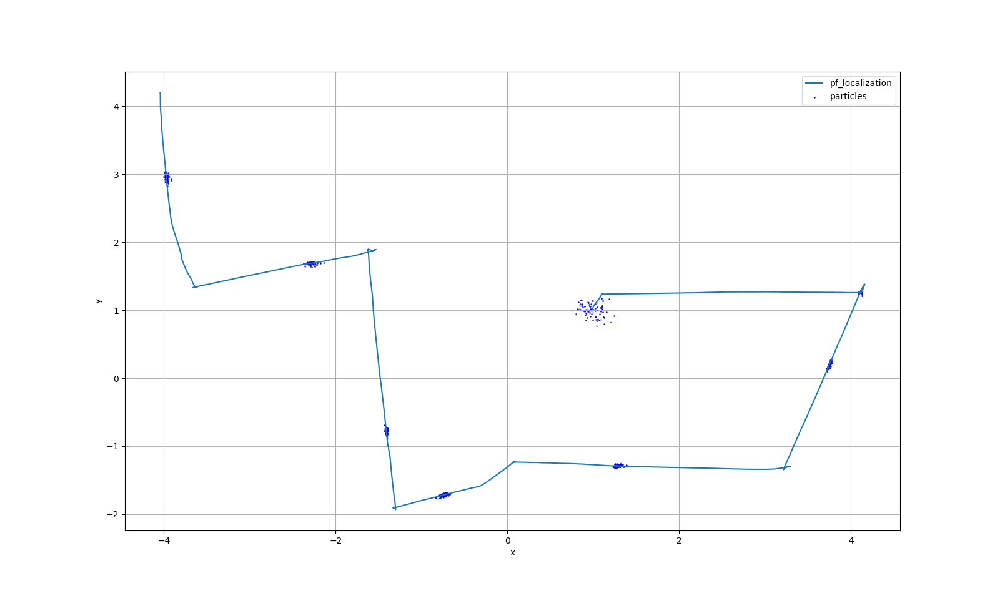
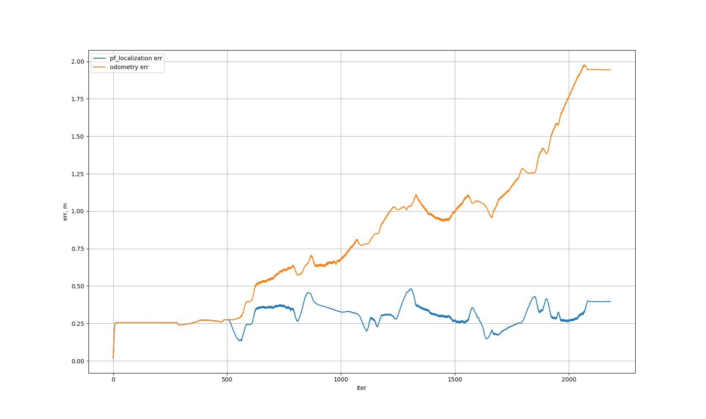

# Particle Filter Localization
## Description

## Topics
### Subscribed Topics
`map` \
`diff_drive/odometry` \
`diff_drive/scan`
### Published Topics
`pose`
## Parameters
`base_frame_id` \
`odom_frame_id` \
`global_frame_id` \
`num_particles` \
`laser_beams` \
`laser_sigma_hit` \
`laser_z_hit` \
`laser_z_rand` \
`laser_z_short` \
`laser_z_max` \
`laser_lambda_short` \
`odom_alpha1` \
`odom_alpha2` \
`odom_alpha3` \
`odom_alpha4`
## TF
`odom_frame_id` -> `global_frame_id`